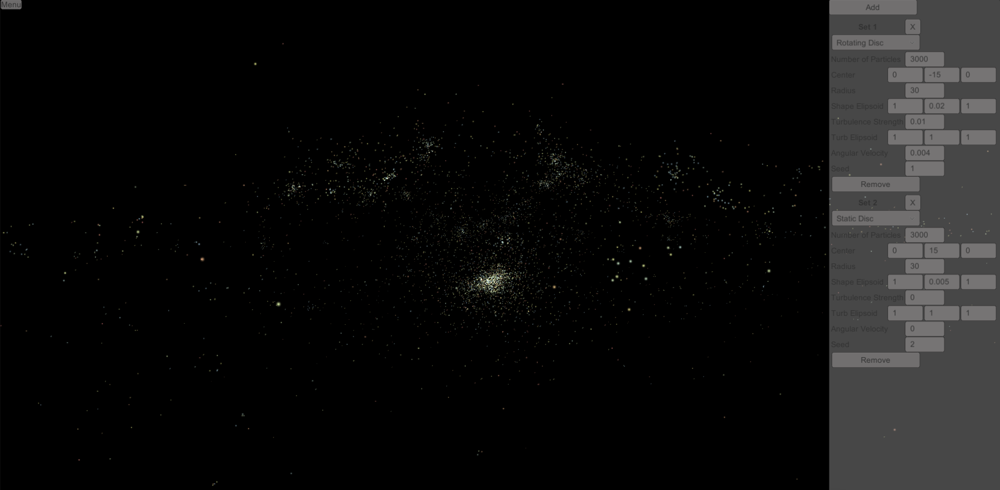

# N-Body Simulator

This repository contains Unity implementation of a simple N-body simulator. Simulator performs gravity calculations in a simple O(N^2) scaling. Calculations are using double precision. The simulator runs with Unity job system and Burst compiler. As a result running a simulation step in each update can handle around 8000 particles at 20 FPS.

In addition to the simulator itself, the project includes basic UI controls. The player can rotate the camera using WASD keys or zoom using a mouse scroll wheel. There are also implemented simulator controls through UI where the player can add or remove sets of particles into existing simulation while on runtime. The UI allows the player to define randomly generated initial conditions with 3D ellipsoidal geometries, angular momentum and turbulence.

In order to run the project, simply clone the repository, open the Main scene in Unity and click the Play button. Simulator controls menu can be opened by clicking the "Menu" button in the upper left corner during the gameplay. Once done, clicking the "Menu" button again will close the controls menu.

MIT License.
